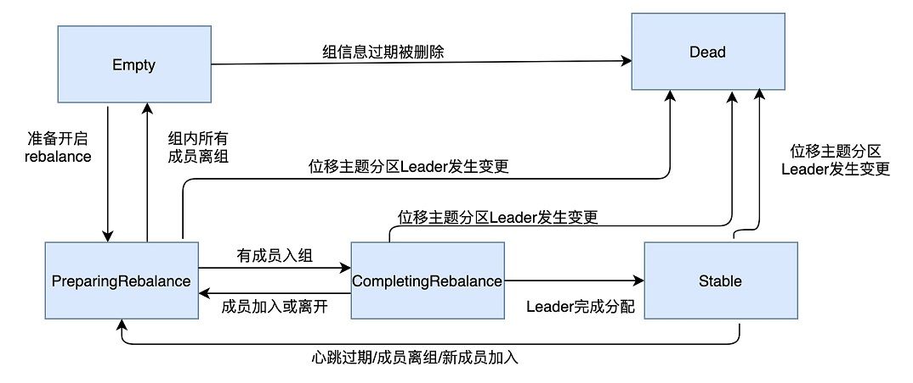
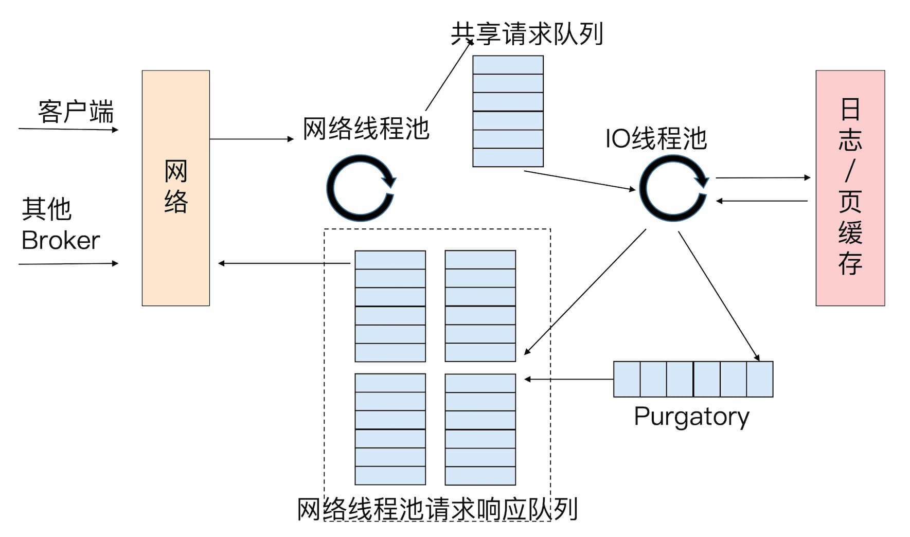
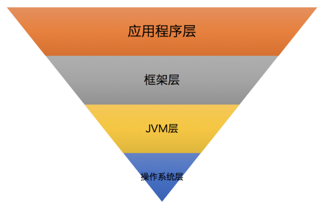

## 简介

Apach Kafka 是一款**分布式流处理框架**，用于实时构建流处理应用。它有一个核心的功能广为人知，即作为**企业级的消息引擎**被广泛使用。

很多主流消息引擎系统都支持 JMS（Java Message Service）规范，比如 ActiveMQ、RabbitMQ、IBM 的 WebSphere MQ 和 Apache Kafka。Kafka 并未完全遵照 JMS 规范。

像 RabbitMQ 或 ActiveMQ 这样的传统消息中间件，它们处理和响应消息的方式是破坏性的（destructive），即一旦消息被成功处理，就会被从 Broker 上删除。

## 集群部署

### 硬件

操作系统：Linux。IO模型；零拷贝  
磁盘  
磁盘容量  
带宽

I/O 模型与 Kafka 的关系又是什么呢？实际上 Kafka 客户端底层使用了 **Java 的 selector，selector 在 Linux 上的实现机制是 epoll，而在 Windows 平台上的实现机制是 select**。因此在这一点上将 Kafka 部署在 Linux 上是有优势的，因为能够获得更高效的 I/O 性能。

主流的 I/O 模型通常有 5 种类型：阻塞式 I/O、非阻塞式 I/O、I/O 多路复用、信号驱动 I/O 和异步 I/O。每种 I/O 模型都有各自典型的使用场景，比如 Java 中 Socket 对象的阻塞模式和非阻塞模式就对应于前两种模型；而 Linux 中的系统调用 select 函数就属于 I/O 多路复用模型；大名鼎鼎的 epoll 系统调用则介于第三种和第四种模型之间；至于第五种模型，其实很少有 Linux 系统支持，反而是 Windows 系统提供了一个叫 IOCP 线程模型属于这一种。

### 重要的参数配置

#### Broker参数

log.dirs=/home/kafka1,/home/kafka2,/home/kafka3

zookeeper.connect  
多个 Kafka 集群使用同一套 ZooKeeper 集群，zookeeper.connect参数可以这样指定：zk1:2181,zk2:2181,zk3:2181/kafka1和zk1:2181,zk2:2181,zk3:2181/kafka2。切记 chroot 只需要写一次，而且是加到最后的。我经常碰到有人这样指定：zk1:2181/kafka1,zk2:2181/kafka2,zk3:2181/kafka3，这样的格式是不对的。

listeners：学名叫监听器，其实就是告诉外部连接者要通过什么协议访问指定主机名和端口开放的 Kafka 服务。  
advertised.listeners：和 listeners 相比多了个 advertised。Advertised 的含义表示宣称的、公布的，就是说这组监听器是 Broker 用于对外发布的。

log.retention.hours=168  
log.retention.bytes：这是指定 Broker 为消息保存的总磁盘容量大小  
message.max.bytes：控制 Broker 能够接收的最大消息大小

#### Topic参数

retention.ms：规定了该 Topic 消息被保存的时长。默认是 7 天，即该 Topic 只保存最近 7 天的消息。一旦设置了这个值，它会覆盖掉 Broker 端的全局参数值。（**待验证。**oracle上面创建了kafka，broker参数为100天，topic删除为默认7天。今天生产了消息，7天后看是否删除消息。2022-03-27 00:52）

max.message.bytes。它决定了 Kafka Broker 能够正常接收该 Topic 的最大消息大小。注意与broker的参数message.max.bytes不同。

#### JVM参数

heap size：6GB，这是目前业界比较公认的一个合理值。默认 1GB 有点小，毕竟 Kafka Broker 在与客户端进行交互时会在 JVM 堆上创建大量的 ByteBuffer 实例。

使用 G1 收集器。在没有任何调优的情况下，G1 表现得要比 CMS 出色，主要体现在更少的 Full GC，需要调整的参数更少。

```bash
$> export KAFKA_HEAP_OPTS=--Xms6g  --Xmx6g
$> export KAFKA_JVM_PERFORMANCE_OPTS= -server -XX:+UseG1GC -XX:MaxGCPauseMillis=20 -XX:InitiatingHeapOccupancyPercent=35 -XX:+ExplicitGCInvokesConcurrent -Djava.awt.headless=true
```

#### 操作系统参数

文件描述符限制：通常情况下将它设置成一个超大的值是合理的做法，比如ulimit -n 1000000，避免“Too many open files”的错误。

文件系统类型：XFS 的性能要强于 ext4。

Swappiness：网上很多文章都提到设置其为 0，将 swap 完全禁掉以防止 Kafka 进程使用 swap 空间。我个人反倒觉得还是不要设置成 0 比较好，我们可以设置成一个较小的值。为什么呢？因为一旦设置成 0，当物理内存耗尽时，操作系统会触发 OOM killer 这个组件，它会随机挑选一个进程然后 kill 掉，即根本不给用户任何的预警。但如果设置成一个比较小的值，当开始使用 swap 空间时，你至少能够观测到 Broker 性能开始出现急剧下降，从而给你进一步调优和诊断问题的时间。基于这个考虑，我个人建议将 swappniess 配置成一个接近 0 但不为 0 的值，比如 1。

提交时间：即 Flush 落盘时间。向 Kafka 发送数据并不是真要等数据被写入磁盘才会认为成功，而是只要数据被写入到操作系统的页缓存（Page Cache）上就可以了，随后操作系统根据 LRU 算法会定期将页缓存上的“脏”数据落盘到物理磁盘上。这个定期就是由提交时间来确定的，默认是 5 秒。一般情况下我们会认为这个时间太频繁了，可以适当地增加提交间隔来降低物理磁盘的写操作。当然你可能会有这样的疑问：如果在页缓存中的数据在写入到磁盘前机器宕机了，那岂不是数据就丢失了。的确，这种情况数据确实就丢失了，但鉴于 Kafka 在软件层面已经提供了多副本的冗余机制，因此这里稍微拉大提交间隔去换取性能还是一个合理的做法。

## 生产端和消费端

### 压缩

Producer 端压缩、Broker 端保持、Consumer 端解压缩。

在吞吐量方面：LZ4 > Snappy > zstd 和 GZIP；而在压缩比方面，zstd > LZ4 > GZIP > Snappy。因此，推荐**LZ4**。

### 拦截器

在应用程序不修改的情况下，动态的实现一组可插拔的事件处理逻辑链。它能在主业务操作的前后多个时间点上插入对应的拦截逻辑。可用于客户端监控、添加消息头、审计、端到端系统性能监测等。

```java
Properties props = new Properties();
List<String> interceptors = new ArrayList<>();
interceptors.add("com.yourcompany.kafkaproject.interceptors.AddTimestampInterceptor"); // 拦截器1
interceptors.add("com.yourcompany.kafkaproject.interceptors.UpdateCounterInterceptor"); // 拦截器2
props.put(ProducerConfig.INTERCEPTOR_CLASSES_CONFIG, interceptors);
```

#### 生产者拦截器

实现 org.apache.kafka.clients.producer.ProducerInterceptor 接口：

* onSend：该方法会在消息发送之前被调用
* onAcknowledgement：该方法会在消息成功提交或发送失败之后被调用，早于 callback 的调用

#### 消费者拦截器

实现 org.apache.kafka.clients.consumer.ConsumerInterceptor 接口：

* onConsume：该方法在消息返回给 Consumer 程序之前调用
* onCommit：Consumer 在提交位移之后调用该方法

### 生产者如何管理TCP连接

[13 | Java生产者是如何管理TCP连接的？ (geekbang.org)](https://time.geekbang.org/column/article/103844)

1. KafkaProducer 实例创建时启动 Sender 线程，从而创建与 bootstrap.servers 中所有 Broker 的 TCP 连接。
2. KafkaProducer 实例首次更新元数据信息之后，还会再次创建与集群中所有 Broker 的 TCP 连接。
3. 如果 Producer 端发送消息到某台 Broker 时发现没有与该 Broker 的 TCP 连接，那么也会立即创建连接。
4. 如果设置 Producer 端 connections.max.idle.ms 参数（默认9分钟）大于 0，则步骤 1 中创建的 TCP 连接会被自动关闭；如果设置该参数 =-1，那么步骤 1 中创建的 TCP 连接将无法被关闭，从而成为“僵尸”连接（TCP 连接是在 Broker 端被关闭的，但其实这个 TCP 连接的发起方是客户端，因此在 TCP 看来，这属于被动关闭的场景，即 passive close。被动关闭的后果就是会产生大量的 CLOSE_WAIT 连接，因此 Producer 端或 Client 端没有机会显式地观测到此连接已被中断）。

### 消费者组

#### 重平衡

重平衡很慢，效率低，应尽量避免。因为参数或逻辑不合理（poll之后处理时间太长）而导致的组成员意外离组或退出：

* session.timeout.ms 默认10s
* heartbeat.interval.ms 默认3s
* max.poll.interval.ms 默认300s
* GC 参数。程序频发 Full GC 引发的非预期 Rebalance

成员**被动**退出后，再次去提交offset时，会报错：

> org.apapache.kafka.clients.consumer.internals.ConsumerCoordinator: [Consumer clientId=xx, groupId=xx] Offset commit failed on partition xx-1 at offset xx: The coordinator is not aware of this member.
>

### 多线程消费

Java Consumer 是双线程的设计。一个线程是用户主线程，负责获取消息；另一个线程是心跳线程，负责向 Kafka 汇报消费者存活情况。将心跳单独放入专属的线程，能够有效地规避因消息处理速度慢而被视为下线的“假死”情况。

多线程方案：

1. 消费者程序启动多个线程，每个线程维护**专属的 KafkaConsumer 实例**，负责完整的消息获取、消息处理流程。【实例是各自独立的】
2. 消费者程序使用单或多线程获取消息，同时创建多个消费线程执行消息处理逻辑。拉取消息的consumer线程与实际干活的worker是1:n的关系。

    1. 优势：伸缩性好。worker线程池和拉消息的线程独立，可以分别扩展
    2. 劣势：无法保证顺序。eg：一个consumer实例拉取一批消息，交给10个worker线程处理，这批消息的处理顺序就打乱了。

### 消费者是如何管理TCP连接

#### 何时创建 TCP 连接

和生产者不同的是，构建 KafkaConsumer 实例时是不会创建任何 TCP 连接的，也就是说，当你执行完 new KafkaConsumer(properties) 语句后，你会发现，没有 Socket 连接被创建出来。这一点和 Java 生产者是有区别的，主要原因就是生产者入口类 KafkaProducer 在构建实例的时候，会在后台默默地启动一个 Sender 线程，这个 Sender 线程负责 Socket 连接的创建。

消费者的TCP 连接是在调用 KafkaConsumer.poll 方法时被创建的。再细粒度地说，在 poll 方法内部有 3 个时机可以创建 TCP 连接：

1. 发起 FindCoordinator 请求时，希望 Kafka 集群告诉它哪个 Broker 是管理它的协调者。消费者应该向哪个 Broker 发送这类请求呢？理论上任何一个 Broker 都能回答这个问题，也就是说消费者可以发送 FindCoordinator 请求给集群中的任意服务器。在这个问题上，社区做了一点点优化：消费者程序会向集群中当前负载最小的那台 Broker 发送请求。负载是如何评估的呢？其实很简单，就是看消费者连接的所有 Broker 中，谁的待发送请求最少。
2. 连接协调者时
3. 消费数据时

#### 何时关闭 TCP 连接

和生产者类似，消费者关闭 Socket 也分为主动关闭和 Kafka 自动关闭。

* 主动关闭：KafkaConsumer.close() 方法，或 Kill -2 、Kill -9
* 自动关闭：由消费者端参数 connection.max.idle.ms 控制，默认 9 分钟

### 消费者组重平衡

消费者端参数 heartbeat.interval.ms 的真实用途：从字面上看，它就是设置了心跳的间隔时间，但这个参数的真正作用是控制重平衡通知的频率。如果你想要消费者实例更迅速地得到通知，那么就可以给这个参数设置一个非常小的值，这样消费者就能更快地感知到重平衡已经开启了。

|消费者组的状态|含义|
| --------------------| ------------------------------------------------------------------------------------------------------------------------------------------------------|
|Empty|组内没有任何成员，但消费者组可能存在已提交的位移数据，而且这些位移尚未过期。<br />|
|Dead<br />|同样是组内没有任何成员，但组的元数据信息已经在协调者端被移除。<br />协调者组件保存着当前向它注册过的所有组信息，所谓的元数据信息就类似于这个注册信息。<br />|
|PreparingRebalance|消费者组准备开启重平衡，此时所有成员都要重新请求加入消费者组。|
|CompleingRebalance|消费者组下所有成员已经加入，各个成员正在等待分配方案。<br />该状态在老一点的版本中被称为AwaitingSync,它和CompletingRebalance是等价的。<br />|
|Stable|消费者组的稳定状态。该状态表明重平衡已经完成，组内各成员能够正常消费数据了。|



一个消费者组最开始是 Empty 状态，当重平衡过程开启后，它会被置于 PreparingRebalance 状态等待成员加入，之后变更到 CompletingRebalance 状态等待分配方案，最后流转到 Stable 状态完成重平衡。  
当有新成员加入或已有成员退出时，消费者组的状态从 Stable 直接跳到 PreparingRebalance 状态，此时，所有现存成员就必须重新申请加入组。当所有成员都退出组后，消费者组状态变更为 Empty。Kafka 定期自动删除过期位移的条件就是，组要处于 Empty 状态。因此，如果你的消费者组停掉了很长时间（超过 7 天），那么 Kafka 很可能就把该组的位移数据删除了。我相信，你在 Kafka 的日志中一定经常看到下面这个输出：  
Removed xxx expired offsets in xxx milliseconds.  
这就是 Kafka 在尝试定期删除过期位移。现在你知道了，只有 Empty 状态下的组，才会执行过期位移删除的操作。

重平衡分为两个步骤：分别是加入组和等待领导者消费者（Leader Consumer）分配方案。这两个步骤分别对应两类特定的请求：JoinGroup 请求和 SyncGroup 请求。第一个发送 JoinGroup 请求的成员自动成为领导者。领导者消费者的任务是收集所有成员的订阅信息，然后根据这些信息，制定具体的分区消费分配方案。

## Broker端

### 控制器

它的主要作用是在 ZooKeeper 的帮助下管理和协调整个 Kafka 集群。集群中任意一台 Broker 都能充当控制器的角色，但是，在运行过程中，只能有一个 Broker 成为控制器。第一个在 ZooKeeper 成功创建 /controller 节点的 Broker 会被指定为控制器。

* 控制器是做什么的？

  1. 主题管理（创建、删除、增加分区）
  2. 分区重分配
  3. Preferred 领导者选举：为了避免部分 Broker 负载过重而提供的一种换 Leader 的方案
  4. 集群成员管理（新增 Broker、Broker 主动关闭、Broker 宕机），依赖 ZooKeeper Watch、临时节点
  5. 数据服务。控制器上保存了最全的集群元数据信息，其他所有 Broker 会定期接收控制器发来的元数据更新请求，从而更新其内存中的缓存数据。这些数据其实在 ZooKeeper 中也保存了一份。每当控制器初始化时，它都会从 ZooKeeper 上读取对应的元数据并填充到自己的缓存中。

#### 控制器内部设计原理

多线程访问共享可变数据是维持线程安全最大的难题。为了保护数据安全性，控制器不得不在代码中大量使用 ReentrantLock 同步机制。社区于 0.11 版本重构了控制器的底层设计，最大的改进就是，**把多线程的方案改成了单线程加事件队列的方案**。

### 高水位和Leader Epoch

Kafka 的水位不是时间戳，更与时间无关。它是和位置信息绑定的，具体来说，它是用消息位移来表征的。另外，Kafka 源码使用的表述是高水位，因此，今天我也会统一使用“高水位”或它的缩写 HW 来进行讨论。值得注意的是，Kafka 中也有低水位（Low Watermark），它是与 Kafka 删除消息相关联的概念，与今天我们要讨论的内容没有太多联系。

#### 高水位的作用

* 定义消息可见性，即用来标识分区下的哪些消息是可以被消费者消费的。
* 帮助 Kafka 完成副本同步。


在分区高水位以下的消息被认为是已提交消息，反之就是未提交消息。**消费者只能消费已提交消息，即图中位移小于 8 的所有消息。注意，这里我们不讨论 Kafka 事务，因为事务机制会影响消费者所能看到的消息的范围，它不只是简单依赖高水位来判断。它依靠一个名为 LSO（Log Stable Offset）的位移值来判断事务型消费者的可见性。**  
另外，需要关注的是，位移值等于高水位的消息也属于未提交消息。也就是说，高水位上的消息是不能被消费者消费的。  
图中还有一个日志末端位移的概念，即 Log End Offset，简写是 LEO。它表示副本写入下一条消息的位移值。注意，数字 15 所在的方框是虚线，这就说明，这个副本当前只有 15 条消息，位移值是从 0 到 14，下一条新消息的位移是 15。显然，介于高水位和 LEO 之间的消息就属于未提交消息。这也从侧面告诉了我们一个重要的事实，那就是：同一个副本对象，其高水位值不会大于 LEO 值。  
Kafka 使用 Leader 副本的高水位来定义所在分区的高水位。

#### Leader Epoch

高水位在界定 Kafka 消息对外可见性以及实现副本机制等方面起到了非常重要的作用，但其设计上的缺陷给 Kafka 留下了很多数据丢失或数据不一致的潜在风险。为此，社区引入了 Leader Epoch 机制，尝试规避掉这类风险。

Leader Epoch 大致可以认为是 Leader 版本。它由两部分数据组成：

* Epoch。一个单调增加的版本号。每当副本领导权发生变更时，都会增加该版本号。小版本号的 Leader 被认为是过期 Leader，不能再行使 Leader 权力。
* 起始位移（Start Offset）。Leader 副本在该 Epoch 值上写入的首条消息的位移。

### 副本机制

* 提供数据冗余
* 提供高伸缩性。增加机器->提升读性能->提高读操作吞吐量
* 改善数据局部性

Leader Replica 和 Follower Replica，Follower 不对外提供服务，原因：

* 方便实现“Read-your-writes”：当你使用生产者 API 向 Kafka 成功写入消息后，马上使用消费者 API 去读取刚才生产的消息。发微博时，你发完一条微博，肯定是希望能立即看到的，这就是典型的 Read-your-writes 场景。
* 方便实现单调读（Monotonic Reads）：对于一个消费者用户而言，在多次消费消息时，它不会看到某条消息一会儿存在一会儿不存在。

#### In-sync Replicas（ISR）

ISR 不只是追随者副本集合，它必然包括 Leader 副本。

Broker 端参数 replica.lag.time.max.ms：指定 Follower 副本能够落后 Leader 副本的最长时间间隔，默认值是 10 秒。

#### 日志截断

类似数据库的回滚，删除无效的消息。

### 请求是怎么被处理的

所有的请求都是通过 TCP 网络以 Socket 的方式进行通讯的。

#### 处理请求的 2 种常见方案

（1）顺序处理请求。吞吐量太差

```java

while (true) {
    Request request = accept(connection);
    handle(request);
}
```

（2）每个请求使用单独线程处理，异步。每个请求都创建线程，开销大

```java

while (true) {
    Request = request = accept(connection);
    Thread thread = new Thread(() -> { 
        handle(request);});
    thread.start();
}
```

#### Kafka 使用 Reactor 模式

Reactor 模式是事件驱动架构的一种实现方式，用于处理多个客户端并发向服务器端发送请求的场景。Reactor 有个请求分发线程 Dispatcher，也就是图中的 Acceptor。Kafka 提供了 Broker 端参数 num.network.threads，用于调整该网络线程池的线程数。其默认值是 3，表示每台 Broker 启动时会创建 3 个网络线程，专门处理客户端发送的请求。


客户端发来的请求会被 Broker 端的 Acceptor 线程分发到任意一个网络线程中，网络线程拿到请求后，它不是自己处理，而是将请求放入到一个共享请求队列中。Broker 端还有个 IO 线程池，负责从该队列中取出请求，执行真正的处理。Broker 端参数 num.io.threads 控制了这个线程池中的线程数。目前该参数默认值是 8，表示每台 Broker 启动后自动创建 8 个 IO 线程处理请求。

图中有一个叫 Purgatory 的组件，这是 Kafka 中著名的“炼狱”组件。它是用来缓存延时请求（Delayed Request）的。所谓延时请求，就是那些一时未满足条件不能立刻处理的请求。比如设置了 acks=all 的 PRODUCE 请求，一旦设置了 acks=all，那么该请求就必须等待 ISR 中所有副本都接收了消息后才能返回，此时处理该请求的 IO 线程就必须等待其他 Broker 的写入结果。



### 日志

Kafka 源码使用ConcurrentSkipListMap类型来保存日志段对象。好处有两个：线程安全；支持 Key 的排序。

## 消息语义

1. 至多一次
2. 至少一次
3. 有且仅有一次

Kafka默认保证至少一次。也可以保证最多一次，只需让 Producer 禁止重试。

##### 无消息丢失配置

一句话概括，Kafka 只对“已提交”的消息（committed message）做有限度的持久化保证。

一句话概括，Kafka 只对“已提交”的消息（committed message）做有限度的持久化保证。有限度：假如你的消息保存在 N 个 Kafka Broker 上，那么这个**前提条件**就是这 N 个 Broker 中至少有 1 个存活。只要这个条件成立，Kafka 就能保证你的这条消息永远不会丢失。

Producer端：

* 使用 producer.send(msg, callback)，而非producer.send(msg)
* acks = all
* retries > 0，网络抖动时重试

Broker端：

* unclean.leader.election.enable = false，不允许落后太多的follower成为leader
* replication.factor >= 3，多副本
* min.insync.replicas > 1，消息至少要被写入到多少个副本才算是“已提交”。设置成大于 1 可以提升消息持久性。默认值 1。
* 确保 replication.factor > min.insync.replicas，如果两者相等，那么只要有一个副本挂机，整个分区就无法正常工作了。

Consumer端：

* enable.auto.commit = false，手动提交位移

##### 幂等

##### 事务

#### 如何在业务中去重

1. 设置特别的业务字段，用于标识消息的id，再次遇到相同id则直接确认消息；
2. 将业务逻辑设计为幂等，即使发生重复消费，也能保证一致性；


##### 如何保证分区级消息有序

max.in.flight.requests.per.connection=1


Kafka 使用 Compact 策略来删除位移主题（__consumer_offsets）中的过期消息，避免该主题无限期膨胀（使用自送提交时，在闲时状态，消费者会提交很多相同offset的进度）。后台线程 Log Cleaner 会定期地巡检待 Compact 的主题，删除过期消息。


## 运维监控

### 自带脚本

这些命令行脚本很多都是通过连接 ZooKeeper 来提供服务的。kafka-topics 脚本连接 ZooKeeper 时，不会考虑 Kafka 设置的用户认证机制。

#### 测试生产者/消费者性能

kafka-xx-perf-test

#### 查看主题消息总数

Kafka 自带的命令没有提供这样的功能。可以使用 Kafka 提供的工具类 GetOffsetShell 来计算给定主题特定分区当前的最早位移和最新位移，将两者的差值累加起来，就能得到该主题当前总的消息数。对于本例来说，test-topic 总的消息数为 5500000 + 5500000，等于 1100 万条：

```bash

$ bin/kafka-run-class.sh kafka.tools.GetOffsetShell --broker-list kafka-host:port --time -2 --topic test-topic

test-topic:0:0
test-topic:1:0

$ bin/kafka-run-class.sh kafka.tools.GetOffsetShell --broker-list kafka-host:port --time -1 --topic test-topic

test-topic:0:5500000
test-topic:1:5500000
```

#### 查看消息文件数据

kafka-dump-log：

```bash

$ bin/kafka-dump-log.sh --files ../data_dir/kafka_1/test-topic-1/00000000000000000000.log --deep-iteration --print-data-log
```

### AdminClient

服务器端也有一个 AdminClient，包路径是 kafka.admin。这是之前的老运维工具类，提供的功能也比较有限，社区已经不再推荐使用它了。所以，我们最好统一使用客户端的 AdminClient。

#### 工作原理

AdminClient 是一个双线程的设计：前端主线程和后端 I/O 线程。前端线程负责将用户要执行的操作转换成对应的请求，然后再将请求发送到后端 I/O 线程的队列中；而后端 I/O 线程从队列中读取相应的请求，然后发送到对应的 Broker 节点上，之后把执行结果保存起来，以便等待前端线程的获取。

### 认证授权

#### 认证

截止到当前最新的 2.3 版本，Kafka 支持基于 SSL 和基于 SASL 的安全认证机制。基于 SSL 的认证主要是指 Broker 和客户端的双路认证（2-way authentication）。通常来说，SSL 加密（Encryption）已经启用了单向认证，即客户端认证 Broker 的证书（Certificate）。如果要做 SSL 认证，那么我们要启用双路认证，也就是说 Broker 也要认证客户端的证书。

Kafka 还支持通过 SASL 做客户端认证。SASL 是提供认证和数据安全服务的框架。Kafka 支持的 SASL 机制有 5 种：

1. GSSAPI：也就是 Kerberos 使用的安全接口，是在 0.9 版本中被引入的。适用于本身已经做了 Kerberos 认证的场景，这样的话，SASL/GSSAPI 可以实现无缝集成
2. PLAIN：是使用简单的用户名 / 密码认证的机制，在 0.10 版本中被引入。配置和运维成本小。不能动态地增减认证用户：所有认证用户信息全部保存在静态文件中，所以只能重启 Broker，才能重新加载变更后的静态文件
3. SCRAM：主要用于解决 PLAIN 机制安全问题的新机制，是在 0.10.2 版本中被引入的。如果你打算使用 SASL/PLAIN，不妨改用 SASL/SCRAM
4. OAUTHBEARER：是基于 OAuth 2 认证框架的新机制，在 2.0 版本中被引进。
5. Delegation Token：补充现有 SASL 机制的轻量级认证机制，是在 1.1.0 版本被引入的。

#### 授权

[34 | 云环境下的授权该怎么做？ (geekbang.org)](https://time.geekbang.org/column/article/120099)

所谓授权，一般是指对与信息安全或计算机安全相关的资源授予访问权限，特别是存取控制。具体到权限模型，常见的有四种。

* ACL：Access-Control List，访问控制列表。
* RBAC：Role-Based Access Control，基于角色的权限控制。
* ABAC：Attribute-Based Access Control，基于属性的权限控制。
* PBAC：Policy-Based Access Control，基于策略的权限控制。

在典型的互联网场景中，前两种模型应用得多，后面这两种则比较少用。ACL 模型很简单，它表征的是用户与权限的直接映射关系；而 RBAC 模型则加入了角色的概念，支持对用户进行分组。

Kafka 用的是 ACL 模型。简单来说，这种模型就是规定了什么用户对什么资源有什么样的访问权限。我们可以借用官网的一句话来统一表示这种模型：“**Principal P is [Allowed/Denied] Operation O From Host H On Resource R**.” 这句话中出现了很多个主体：

* Principal：表示访问 Kafka 集群的用户。
* Operation：表示一个具体的访问类型，如读写消息或创建主题等。
* Host：表示连接 Kafka 集群的客户端应用程序 IP 地址。Host 支持星号占位符，表示所有 IP 地址。
* Resource：表示 Kafka 资源类型。如果以最新的 2.3 版本为例，Resource 共有 5 种，分别是 TOPIC、CLUSTER、GROUP、TRANSACTIONALID 和 DELEGATION TOKEN。

当前，Kafka 提供了一个可插拔的授权实现机制。该机制会将你配置的所有 ACL 项保存在 ZooKeeper 下的 **/kafka-acl** 节点中。你可以通过 Kafka 自带的 **kafka-acls** 脚本动态地对 ACL 项进行增删改查，并让它立即生效。

开启 ACL 的方法特别简单，只需要在 Broker 端的配置文件  server.properties 文件中配置下面这个参数值：

```properties
authorizer.class.name=kafka.security.auth.SimpleAclAuthorizer
```

Kafka 的授权机制可以不配置认证机制单独使用，但是只能为IP地址设置权限。

### 跨集群备份MirrorMaker

MirrorMaker本质是从源集群消费数据，然后用生产者发送到目标集群。

它提供的功能很有限，运维成本高，比如主题的管理就非常不便捷，同时也很难将其管道化。基于这些原因，业界很多公司选择自己开发跨集群镜像工具：

* Uber 的 uReplicator
* LinkedIn 开发的 Brooklin Mirror Maker
* Confluent 公司研发的 Replicator。最强，收费

### 监控

* 主机监控
* JVM监控：监控 Broker GC 日志，即以 kafkaServer-gc.log 开头的文件。注意不要出现 Full GC 的字样。一旦发现 Broker 进程频繁 Full GC，可以开启 G1 的 -XX:+PrintAdaptiveSizePolicy 开关，让 JVM 告诉你到底是谁引发了 Full GC。
* 集群监控

#### 监控框架/工具

* JMXTool 工具：kafka-run-class.sh kafka.tools.JmxTool，自带的一个工，能够实时查看 Kafka JMX 指标
* ~~Kafka Manager：久不更新，活跃的代码维护者只有三四个人，无法追上 Apache Kafka 版本的更迭速度~~
* ~~Burrow：LinkedIn 开源的一个专门监控消费者进度的框架，用 Go 写的，没有 UI 界面，只是开放了一些 HTTP Endpoint，久不更新~~
* JMXTrans + InfluxDB + Grafana
* Confluent Control Center：最强大的，企业级，收费
* Kafka Eagle：国人维护，积极演进。除了常规的监控功能之外，还开放了告警功能（Alert），非常值得一试

### 调优

优化漏斗：层级越靠上，其调优的效果越明显



### 动态参数配置

无需重启Broker就能立即生效的参数。

* 动态调整Broker端各种线程池大小，实时应对突发流量
* 动态调整Broker端Compact操作性能
* 动态调整Broker端连接信息或安全配置信息
* 动态更新SSL Keystore有效期
* 实时变更JMX指标收集器
* log.retention.ms
* num.io.threads和num.network.threads
* num.replica.fetchers，不超过CPU核数

### node id: -1是什么意思

如下的日志里面：

```plaintext
[2019-05-27 10:00:54,142] DEBUG [Consumer clientId=consumer-1, groupId=test] Initiating connection to node localhost:9092 (id: -1 rack: null) using address localhost/127.0.0.1 (org.apache.kafka.clients.NetworkClient:944)
[2019-05-27 10:00:54,188] DEBUG [Consumer clientId=consumer-1, groupId=test] Sending metadata request MetadataRequestData(topics=[MetadataRequestTopic(name=‘t4’)], allowAutoTopicCreation=true, includeClusterAuthorizedOperations=false, includeTopicAuthorizedOperations=false) to node localhost:9092 (id: -1 rack: null) (org.apache.kafka.clients.NetworkClient:1097)
[2019-05-27 10:00:54,188] TRACE [Consumer clientId=consumer-1, groupId=test] Sending FIND_COORDINATOR {key=test,key_type=0} with correlation id 0 to node -1 (org.apache.kafka.clients.NetworkClient:496)
[2019-05-27 10:00:54,203] TRACE [Consumer clientId=consumer-1, groupId=test] Completed receive from node -1 for FIND_COORDINATOR with correlation id 0, received {throttle_time_ms=0,error_code=0,error_message=null,
```

日志的第一行是消费者程序创建的第一个 TCP 连接，就像我们前面说的，这个 Socket 用于发送 FindCoordinator 请求。由于这是消费者程序创建的第一个连接，此时**消费者对于要连接的 Kafka 集群一无所知，因此它连接的 Broker 节点的 ID 是 -1**，表示消费者根本不知道要连接的 Kafka Broker 的任何信息。

那么 2147483645 这个 id 是怎么来的呢？它是**由 Integer.MAX_VALUE 减去协调者所在 Broker 的真实 ID 计算得来的**。看第四行标为橙色的内容，我们可以知道协调者 ID 是 2，因此这个 Socket 连接的节点 ID 就是 Integer.MAX_VALUE 减去 2，即 2147483647 减去 2，也就是 2147483645。这种节点 ID 的标记方式是 Kafka 社区特意为之的结果，目的就是要让组协调请求和真正的数据获取请求使用不同的 Socket 连接。

### CommitFailedException

这个异常是由于消费者在提交进度时，发现自己已经被开除了，它消费的分区分给别人了。the time between subsequent calls to poll() was longer than the configured max.poll.interval.ms。解决方法：

1. 减少每一批拉取的消息数（max.poll.records）
2. 增加poll间隔时间上限（max.poll.interval.ms）
3. 加快处理速度——多线程消费方案。poll的一批消息交给多个线程处理，使用并发提升吞吐。  
    前提：无顺序要求。  
    难点：进度的提交。poll消息的主线程应该等待所有子线程处理完毕再提交进度。如果某个线程失败了，应用重启后，其他线程再次处理重复消息，需手动去重。

另一个可能的原因，如果standalone组与某个消费group有相同的groupId，也会造成该异常。

* [ ] **groupId和clientId都相同的两个客户端，会造成什么后果？**


### Kafka 能手动删除消息吗

提供了留存策略，能够自动删除过期消息，不需用户手动删除消息。当然，它支持手动删除消息：

* 对于设置了 Key 且参数 cleanup.policy=compact 的主题而言，我们可以构造一条`key=null`的消息发送给 Broker，依靠 Log Cleaner 组件提供的功能删除掉该 Key 的消息。
* 对于普通主题而言，我们可以使用 **kafka-delete-records** 命令，或编写程序调用 Admin.deleteRecords 方法来删除消息。这两种方法殊途同归，底层都是调用 Admin 的 deleteRecords 方法，通过将分区 Log Start Offset 值抬高的方式间接删除消息。

## 流处理

Kafka Connect + Kafka Core + Kafka Streams

## 其他

> 社区最近正在花大力气去优化消费者组机制，力求改善因 Rebalance 导致的各种场景，但其实，其他框架开发者反而是不用 Group 机制的。他们**宁愿自己开发一套机制来维护分区分配的映射**。这些都说明 Kafka 中的消费者组还是有很大的提升空间的。
>

确实，我们的框架也是自己维护分区映射。

## Reference

1. 极客时间 - Kafka 核心技术与实战
